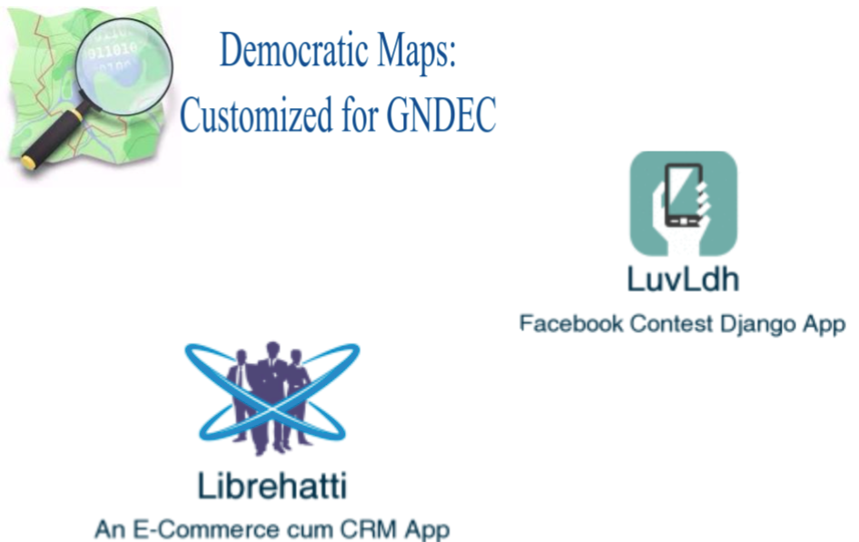
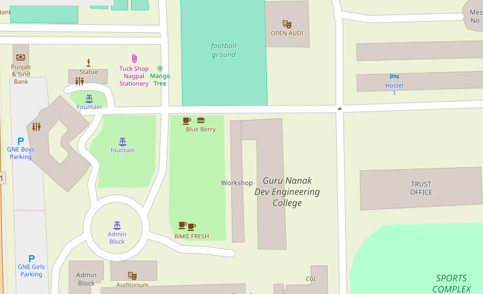
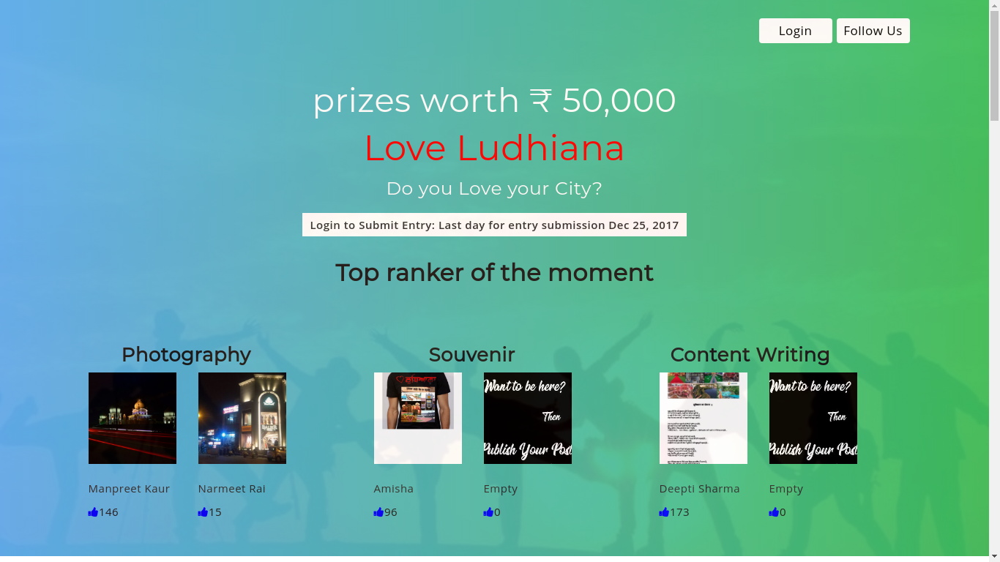
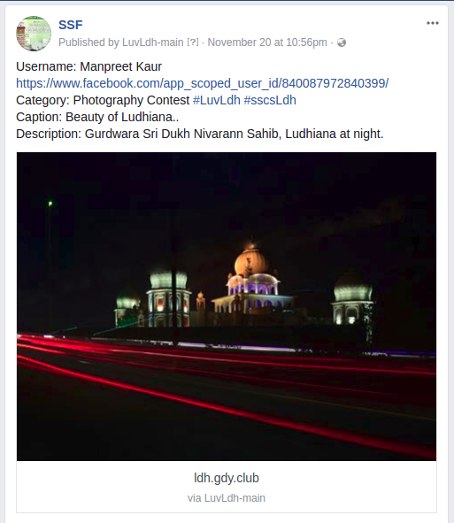

:author: Amihsa Budhiraja
:title: 6-month Training
:data-transition-duration: 1500
:css: tutorial.css

**6-month Training**
===================================

----

:data-x: r-100
:data-y: r+200
:data-rotate-x: 60

*Amisha Budhiraja*

*University Roll No. 1410808*

*College Roll No. 145010*

----

:data-x: r+1500
:data-y: r-1000
:data-rotate-x: 0

.. note:: During my 6-month training, I worked on three main projects: Democratic Map: Customized for GNDEC, LuvLdh and Librehatti. Where Democratic Map being chosen by me as the main project.

----

:data-rotate-x: 90
:data-x: r0
:data-y: r0

Before starting, I want to *acknowledge* some people.

* *Dr. H.S. Rai* (Dean TCC and Head of Training)
* *Mandeep Singh* (Developer of Librehatti)

----

:data-x: r+1500
:data-y: r-1000
:data-scale: 0.3

Democratic Maps: Customized for GNDEC
=====================================

----

:data-x: r+1500
:data-y: r-1000
:data-scale: 0.3

The Existing System
===================

Multiple Organizations like Google Maps, Ordnance Survey provide maps but with the following limitations:

- The data is copyrighted and owned.

- The map can not be customized.

- They are costly.

- Offline inaccessible.

- Mass downloads sometimes impossible.

----

:data-z: r-1000
:data-rotate-z: 60
:data-scale: 5

**But we have a solution.**

----

:data-x: r+1500
:data-y: r-1000
:data-scale: 0.3

OpenStreetMap(OSM)
==================

.. note:: OpenStreetMap is an open-source, free web-based software, owned by you, the contributors. It completely overcome the limitations of the existing system. 
 
----

:data-x: r+1500
:data-y: r-1000
:data-scale: 0.3

Objective of the Project
========================

The main objective of the project is create beautifully customized map for **GNE freshers** to locate the places like labs with Punjabi Language in a 3-D View. Moreover, to encourage the students to contribute to the **open source projects**.

----

:data-x: r+1500
:data-y: r-1000
:data-scale: 0.3

OSM Components 
===============

- Postgresql

- Osm2pgsql

- Mod_tile

- Mapnik

- Openstreetmap-carto

----

:data-y: r-2000
:data-z: r-1300

Technologies Used
==================

* C++
* Cmake
* Shell scripting
* Carto Preprocessor
* JSON
* Git
* Doxygen
* LaTeX
* Hovercraft

----

:data-y: r-2000

**Here, Is the live Demo.**
=============================

----

:data-x: r+1500
:data-y: r-1000
:data-scale: 0.3

Implementation 
===============

- Map of Ludhiana in Punjabi.

- **Search** OSM data by name and address.

- Popup Menus.

- Control Map with **Arrow Keys**.

- **3-D** View of the map.

- GNE **Tour**.

- View **Animations**.

----

:data-x: r0
:data-y: r+1000

- OSM automatic tile server with **shell script**.

- International **boundary** of India with city and country name only. 

- **Admin levels** with different colors with names displayed over each boundary area.

- Modified the **icons** of the nodes.

- Customized the **land colour** or background colour.

- Increased zoom levels to **28** for indoor mapping. 

- Documentation using **Doxygen**.

----

**With this, I end my first project.**
=============================================

* **Clone** from (https://github.com/amisha2016/pbOSM)
* **Documentation** (https://github.com/amisha2016/pbOSM/html/)
* **Blogs** (https://amisha2016.wordpress.com/)

----

:data-y: r0

Love Ludhiana WebApp
=====================

----

A web app developed for **"Love Ludhiana"** contest. As per the contest rules, user has to upload the content only through this app. This app acts as a channel to upload image or PDF to contest's Facebook page.

----

:data-y: r0

Technologies Used
===================

* Python Django Framework
* Facebook Graph API
* Cron Job

----

Website

----

After **Facebook** authentication

.. image:: images/login.png
	:height: 600px
	:width: 1000px
	:class: luv

----

Form submitted

.. image:: images/submitluv.png
	:height: 600px
	:width: 1000px
	:class: luv

----

User post on **Love Ludhiana**

Facebook page

----

:data-rotate-x: 90

* Must **participate** and showcase your city.
* **Source Code**: https://github.com/amisha2016/LuvLdh-Webapp

.. note:: This app will be released in next semester officially and might be even with web client also.

----

**Librehatti**- An E-commerce cum CRM Django App
=================================================

----

:data-y: r-1000
:data-z: r-1000

Implementation 
===============

- Compatibility with latest Django and Python version .

- Added dispatch Register module.

- Added GST Module. 

- Added functionality to make it configurable software like for hospitals, jewellery shop etc.

----

The main benefit of this Project
====================================

- Unlike other CA softwares for example **Busy, SAP** don't provide an individual modules say **catalog**.

- Librehatti follows the modular approach.

- Easily configurabe for different purposes.

.. note:: The main benefit of doing above work through scripting was that same work could be done again in future for any data. In just an hrs, without any human involvement which otherwise could have taken more than a week if done manually.

----

With this, I end my last project.
====================================

* **Source Code**: https://github.com/amisha2016/Librehatti

----

:data-x: r0
:data-y: r0
:data-z: r0
:data-scale: 0.001 
:data-transition-duration: 1

**Thank you...**
==============================

